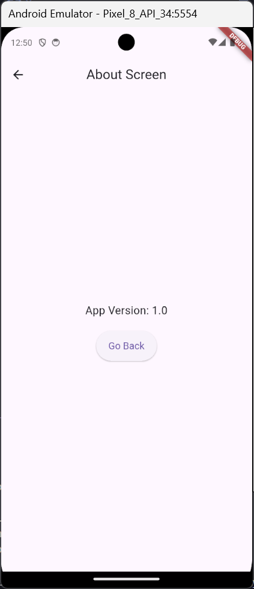

# Tugas 5 - Navigasi di Flutter

**Nama:** Sakahayu Pribadi  
**NPM:** 4522210062  
**Dosen Pengampu:** Adi Wahyu Pribadi S.SI., M.Kom.  
**Program Studi:** Teknik Informatika  
**Universitas Pancasila - 2025**

## Daftar Project

1. [navigation](navigation/)
2. [navigation_20](navigation_20/)
3. [nested_navigation](nested_navigation/)
4. [deep_link_navigation](deep_link_navigation/)

---

## 1. Navigation

- Navigasi menggunakan named routes pada `MaterialApp`.
- Terdapat halaman Home, Detail, Settings, dan About.

**Fitur:**
- Navigasi antar halaman dengan `Navigator.pushNamed`.
- Halaman About menampilkan versi aplikasi.
- Halaman Settings menampilkan username.

**Screenshot:**



---

## 2. Navigation 2.0

- Navigasi menggunakan deklaratif `Navigator` (Navigator 2.0).
- Daftar item dan detail item dengan deskripsi.

**Fitur:**
- State management untuk item yang dipilih.
- Navigasi ke detail item dengan deskripsi.
- Kembali ke Home dengan tombol Back.

**Screenshot:**


---

## 3. Nested Navigation

- Contoh penggunaan nested navigator untuk alur pengaturan perangkat.
- Terdiri dari beberapa layar: Find Devices, Confirm Device, Connect Device.

**Fitur:**
- Navigasi bertingkat di dalam satu flow.
- Setiap langkah memiliki tombol aksi untuk melanjutkan ke langkah berikutnya.
- Tombol kembali untuk keluar dari flow.

**Screenshot:**


---

## 4. Deep Link Navigation

- Implementasi navigasi menggunakan deep link dengan `Router` dan `RouteInformationParser`.
- Mendukung navigasi ke Home, Detail, dan Settings melalui URL.
- Contoh deep link: `/`, `/detail/1`, `/settings`.

**Fitur:**
- Parsing route dari URL.
- Navigasi ke detail item berdasarkan ID.
- Navigasi ke halaman Settings.
- Tombol Settings di Home.

**Screenshot:**


---

## Cara Menjalankan

1. Masuk ke folder project yang diinginkan, misal:
   ```sh
   cd deep_link_navigation
   ```
2. Jalankan perintah berikut:
   ```sh
   flutter pub get
   flutter run
   ```

---

## Lisensi

Proyek ini dibuat untuk keperluan pembelajaran Praktikum Pemrograman Berbasis Mobile.