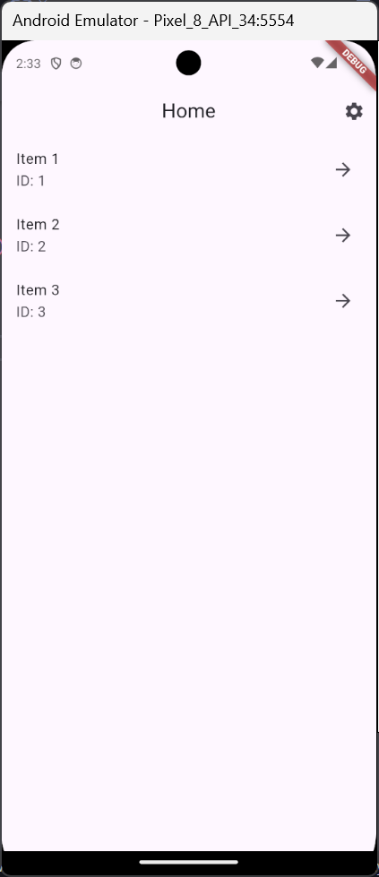
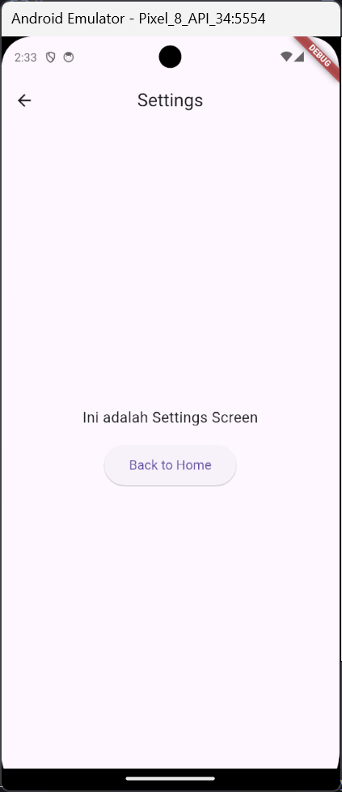

# Tugas 5 - Deep Link Navigation

**Nama:** Sakahayu Pribadi \
**NPM:** 4522210062 \
**Dosen Pengampu:** Adi Wahyu Pribadi S.SI., M.Kom. \
**Program Studi:** Teknik Informatika \
**Universitas Pancasila - 2025**

## Deskripsi

Proyek Flutter ini merupakan tugas praktikum ke-5 pada mata kuliah Praktikum Pemrograman Berbasis Mobile. Proyek ini menampilkan navigasi menggunakan deep link navigation.


---

## 💪 Langkah-langkah Pengerjaan

### 1. Tambahkan route information baru untuk parsing informasi route

```dart
if (uri.pathSegments[0] == 'settings') {
  return RoutePath.settings();
}
```

```dart
if (path.isSettings) {
  return RouteInformation(uri: Uri.parse('/settings'));
}
```

### 2. Tambahkan juga RoutePath baru pada class RoutePath

```dart
final bool isSettings;
```

```dart
RoutePath.settings() : isSettings = true, isHome = false, id = null;
```

### 3. Tambahkan juga Function baru pada AppRouterDelegate

```dart
bool _goToSettings = false;
```

```dart
void goToSettings() {
  _selectedItemId = null;
  _goToSettings = true;
  notifyListeners();
}
```

```dart
@override
RoutePath get currentConfiguration {
  if (_goToSettings) {
    return RoutePath.settings();
  } else if (_selectedItemId != null) {
    return RoutePath.detail(_selectedItemId);
  }
  return RoutePath.home();
}
```

```dart
if (_goToSettings)
  MaterialPage(
    key: const ValueKey('SettingScreen'),
    child: SettingScreen(onBack: goHome),
  ),
```

```dart
@override
Future<void> setNewRoutePath(RoutePath path) async {
  if (path.isHome) {
    _selectedItemId = null;
    _goToSettings = false;
  } else if (path.isSettings) {
    _selectedItemId = null;
    _goToSettings = true;
  } else if (path.isDetail && path.id != null) {
    _selectedItemId = path.id;
    _goToSettings = false;
  }
}
```

### 4. Tambahkan Void Callback dan Button pada Home Screen untuk navigasi ke Settings Screen

```dart
final VoidCallback onSettingsPressed;
```

```dart
  required this.onSettingsPressed,
```

```dart
  actions: [
          IconButton(
            icon: const Icon(Icons.settings),
            onPressed: onSettingsPressed,
          ),
        ],
```

### 5. Buat layar Setting Screen baru dengan MaterialPage dan MaterialApp

```dart
class SettingScreen extends StatelessWidget {
  final VoidCallback onBack;
  const SettingScreen({super.key, required this.onBack});

  @override
  Widget build(BuildContext context) {
    return Scaffold(
      appBar: AppBar(title: const Text('Settings'), centerTitle: true),
      body: Center(
        child: Column(
          mainAxisAlignment: MainAxisAlignment.center,
          children: [
            Text('Ini adalah Settings Screen', style: TextStyle(fontSize: 18)),
            const SizedBox(height: 20),
            ElevatedButton(
              onPressed: onBack,
              style: ElevatedButton.styleFrom(
                padding: const EdgeInsets.symmetric(
                  horizontal: 30,
                  vertical: 15,
                ),
                textStyle: const TextStyle(fontSize: 16),
              ),
              child: const Text('Back to Home'),
            ),
          ],
        ),
      ),
    );
  }
}
```

## Screenshot Hasil Akhir:



