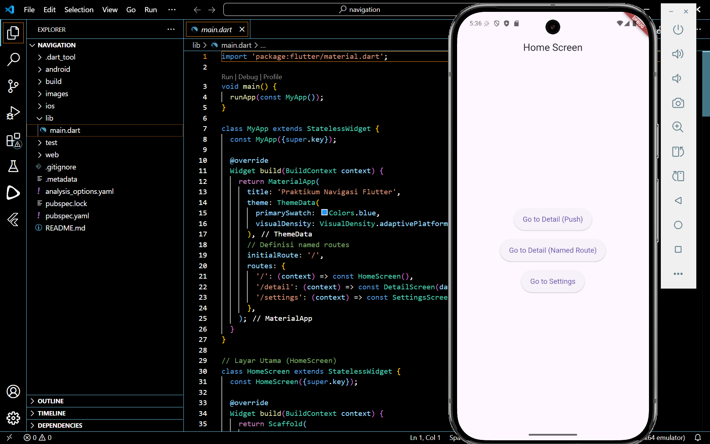
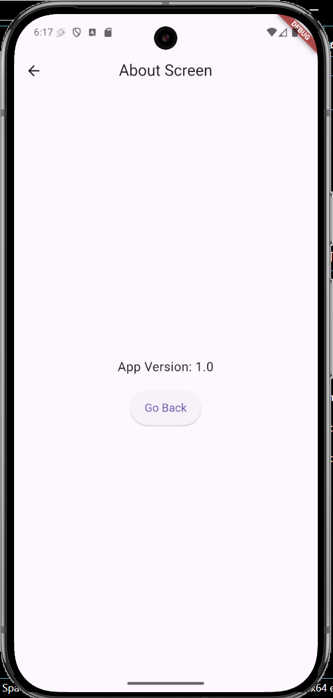
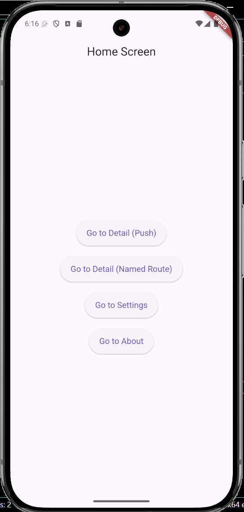

# Tugas 5 - Navigation

**Nama:** Sakahayu Pribadi \
**NPM:** 4522210062 \
**Dosen Pengampu:** Adi Wahyu Pribadi S.SI., M.Kom. \
**Program Studi:** Teknik Informatika \
**Universitas Pancasila - 2025**

## Deskripsi

Proyek Flutter ini merupakan tugas praktikum ke-5 pada mata kuliah Praktikum Pemrograman Berbasis Mobile. Proyek ini menampilkan scene interaktif dengan gesture, drag-and-drop, efek visual, dan fitur zoom/pan menggunakan `PageView`.



---

## 💪 Langkah-langkah Pengerjaan

### 1. Tambah layar baru (About Screen)

Di dalam file `main` pada direktori `lib`, tambahkan class berikut pada akhir program:

```dart
// Layar About (AboutScreen)
class AboutScreen extends StatelessWidget {
  final String version;

  const AboutScreen({super.key, required this.version});

  @override
  Widget build(BuildContext context) {
    return Scaffold(
      appBar: AppBar(
        title: const Text('About Screen'),
        centerTitle: true,
      ),
      body: Center(
        child: Column(
          mainAxisAlignment: MainAxisAlignment.center,
          children: [
            Text(
              'App Version: $version',
              style: const TextStyle(fontSize: 18),
              textAlign: TextAlign.center,
            ),
            const SizedBox(height: 20),
            ElevatedButton(
              onPressed: () {
                Navigator.pop(context);
              },
              style: ElevatedButton.styleFrom(
                padding: const EdgeInsets.symmetric(horizontal: 20, vertical: 15),
                textStyle: const TextStyle(fontSize: 16),
              ),
              child: const Text('Go Back'),
            ),
          ],
        ),
      ),
    );
  }
}
```

### 2. Tambahkan definisi named routes baru

Di dalam file `main` pada direktori `lib`, tambahkan baris berikut pada deklarasi routes:

```dart
        '/about': (context) => const AboutScreen(version: '1.0'),
```

Sehingga menjadi:
```dart
      routes: {
        '/': (context) => const HomeScreen(),
        '/detail': (context) => const DetailScreen(data: 'Hello from Home!'),
        '/settings': (context) => const SettingsScreen(username: 'Guest'),
        '/about': (context) => const AboutScreen(version: '1.0'),
      },
```


### 3. Tambahkan button baru untuk navigasi ke About

Di dalam file `main` pada direktori `lib`, tambahkan baris berikut pada children di body:

```dart
            // Tombol untuk named route ke AboutScreen
            ElevatedButton(
              onPressed: () {
                Navigator.pushNamed(context, '/about');
              },
              style: ElevatedButton.styleFrom(
                padding: const EdgeInsets.symmetric(horizontal: 20, vertical: 15),
                textStyle: const TextStyle(fontSize: 16),
              ),
              child: const Text('Go to About'),
            ),
```

## Screenshot Hasil Akhir:


