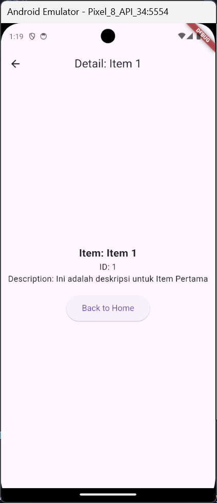

# Tugas 5 - Navigation_20

**Nama:** Sakahayu Pribadi \
**NPM:** 4522210062 \
**Dosen Pengampu:** Adi Wahyu Pribadi S.SI., M.Kom. \
**Program Studi:** Teknik Informatika \
**Universitas Pancasila - 2025**

## Deskripsi

Proyek Flutter ini merupakan tugas praktikum ke-5 pada mata kuliah Praktikum Pemrograman Berbasis Mobile. Proyek ini menampilkan navigasi menggunakan navigator dan penambahan field description pada Item.


---

## 💪 Langkah-langkah Pengerjaan

### 1. Tambahkan field description pada class Item

Di dalam class Item pada file `main`, tambahkan field String description seperti berikut:

```dart
  final String description;
```

dan tambahkan juga field description pada parameter:

```dart
  required this.description
```

sehingga class Item menjadi seperti berikut:

```dart
class Item {
  final int id;
  final String name;
  final String description;

  Item({required this.id, required this.name, required this.description});
}
```

### 2. Tambahkan dan isi masing-masing deskripsi pada saat mendeklarasikan suatu Item

Di dalam List Item pada file `main`, tambahkan parameter description dan isi parameter tersebut, dari:

```dart
  final List<Item> _items = [
    Item(id: 1, name: 'Item 1',),
    Item(id: 2, name: 'Item 2'),
    Item(id: 3, name: 'Item 3'),
  ];
```

Sehingga menjadi:

```dart
  final List<Item> _items = [
    Item(id: 1, name: 'Item 1', description: 'Ini adalah deskripsi untuk Item Pertama'),
    Item(id: 2, name: 'Item 2', description: 'Ini adalah deskripsi untuk Item Kedua'),
    Item(id: 3, name: 'Item 3', description: 'Ini adalah deskripsi untuk Item Ketiga'),
  ];
```

### 3. Tambahkan Text baru pada Detail Screen

Di dalam file `main` pada class `DetailScreen`, tambahkan baris berikut setelah Text ID:

```dart
Text(
              'Description: ${item.description}',
              style: const TextStyle(fontSize: 16),
            ),
```

## Screenshot Hasil Akhir:


