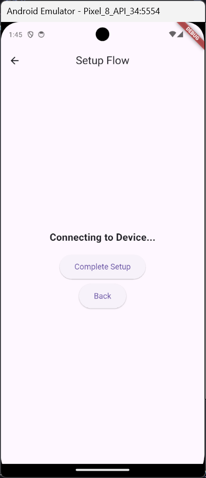

# Tugas 5 - Nested Navigation

**Nama:** Sakahayu Pribadi \
**NPM:** 4522210062 \
**Dosen Pengampu:** Adi Wahyu Pribadi S.SI., M.Kom. \
**Program Studi:** Teknik Informatika \
**Universitas Pancasila - 2025**

## Deskripsi

Proyek Flutter ini merupakan tugas praktikum ke-5 pada mata kuliah Praktikum Pemrograman Berbasis Mobile. Proyek ini menampilkan navigasi menggunakan nested navigation.


---

## 💪 Langkah-langkah Pengerjaan

### 1. Tambahkan function untuk mengkonfirmasi Device

Di dalam class `SetupFlowScreen` pada file `main`, tambahkan function:

```dart
  void _onDeviceConfirmed() {
    _navigatorKey.currentState!.pushNamed('connect_device');
  }
```

### 2. Tambahkan route case baru

Di dalam route case di dalam class `SetupFlowScreen` pada file `main`, tambahkan route case baru seperti:

```dart
            case 'confirm_device':
              page = ConfirmDeviceScreen(onDeviceConfirmed: _onDeviceConfirmed);
              break;
```

### 3. Tambahkan class layar ConfirmDeviceScreen untuk mengkonfirmasi Device

Di dalam file `main`, tambahkan class baru berikut:

```dart
class ConfirmDeviceScreen extends StatelessWidget {
  final VoidCallback onDeviceConfirmed;

  const ConfirmDeviceScreen({super.key, required this.onDeviceConfirmed});

  @override
  Widget build(BuildContext context) {
    return Center(
      child: Column(
        mainAxisAlignment: MainAxisAlignment.center,
        children: [
          const Text(
            'Confirming Device...',
            style: TextStyle(fontSize: 20, fontWeight: FontWeight.bold),
          ),
          const SizedBox(height: 20),
          ElevatedButton(
            onPressed: onDeviceConfirmed,
            style: ElevatedButton.styleFrom(
              padding: const EdgeInsets.symmetric(horizontal: 30, vertical: 15),
              textStyle: const TextStyle(fontSize: 16),
            ),
            child: const Text('Device Confirmed'),
          ),
        ],
      ),
    );
  }
}
```

## Screenshot Hasil Akhir:



